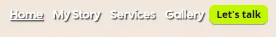
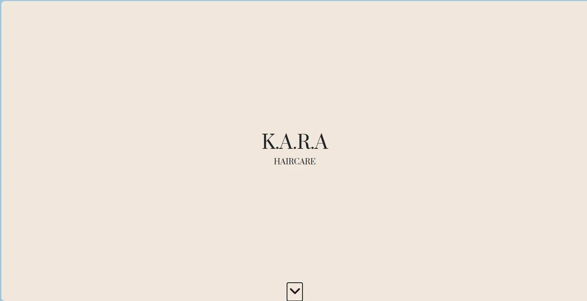
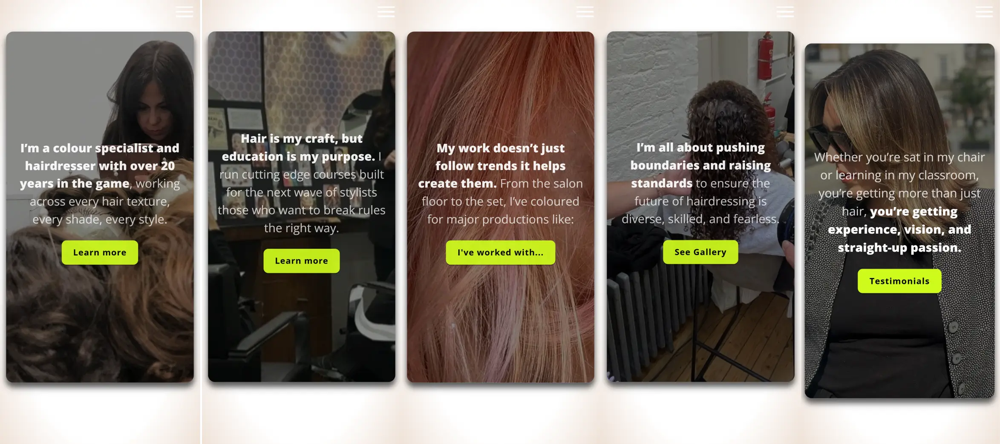
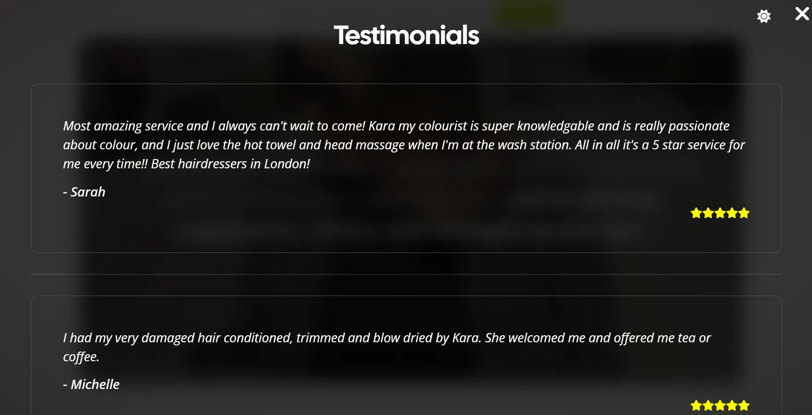
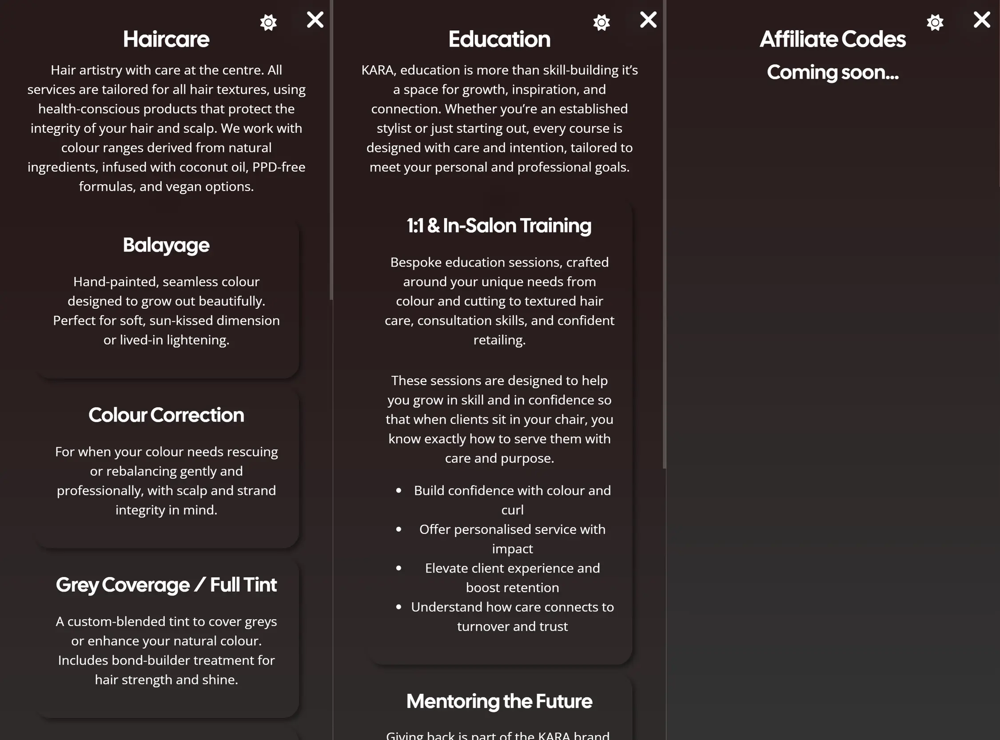
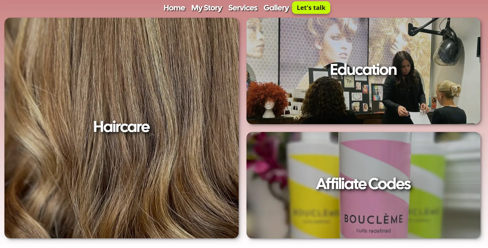
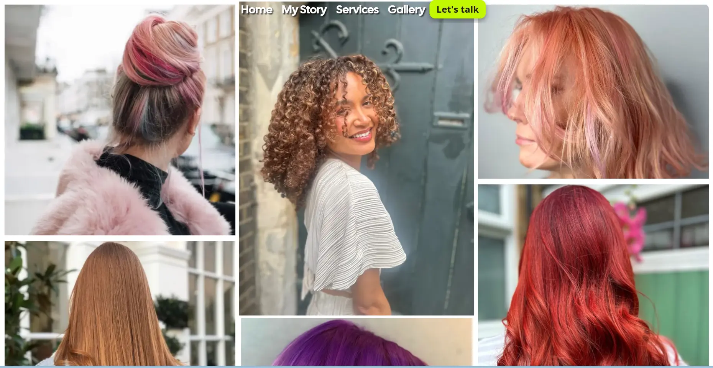
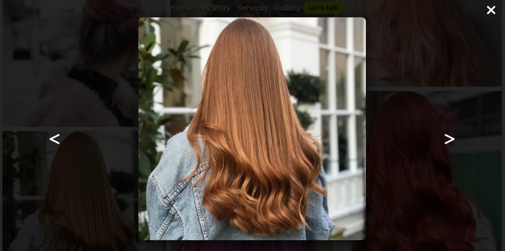
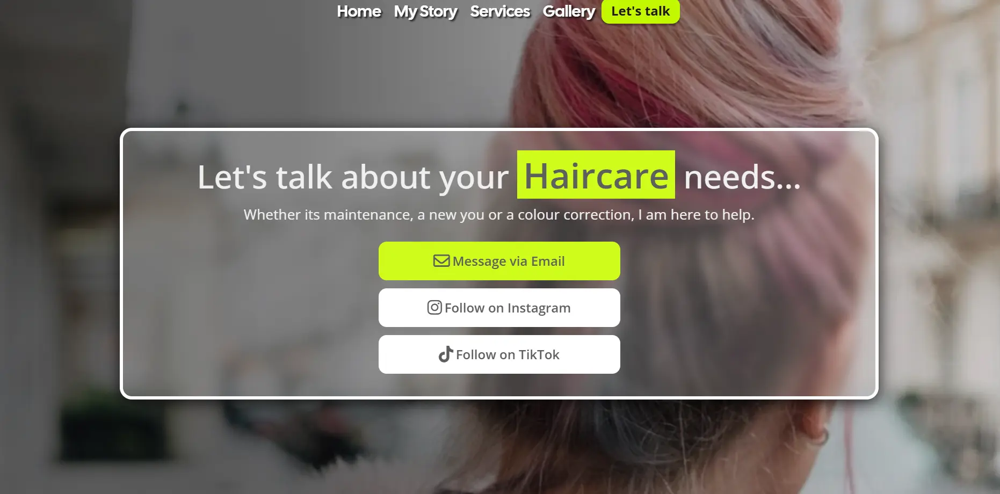
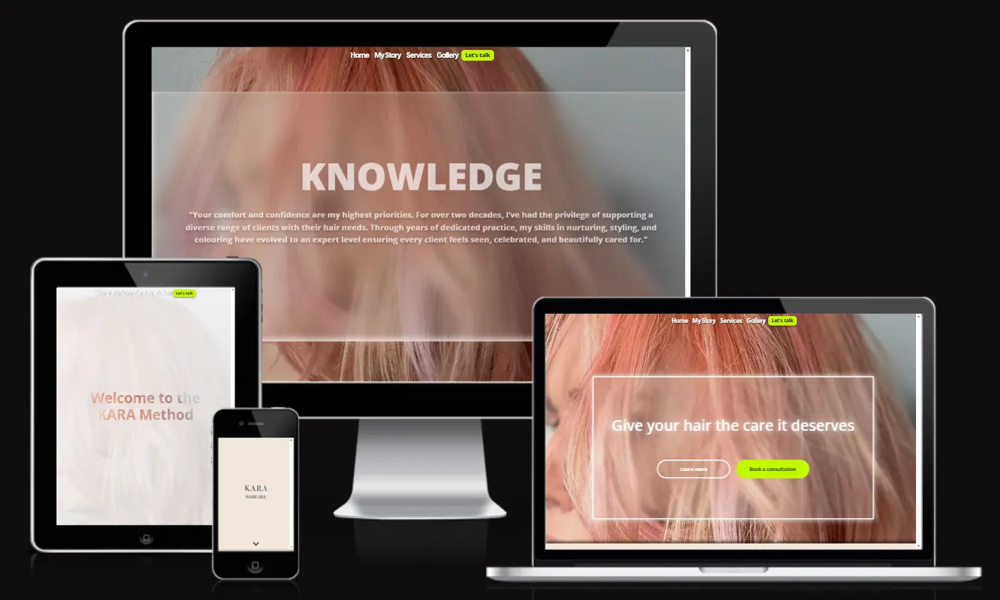

# Kara Haircare Testing

Visit the deployed site: [Kara Haircare](https://karahaircare.co.uk)
---
## CONTENTS

* [AUTOMATED TESTING](#automated-testing)
  * [W3C Validator](#w3c-validator)
  * [JavaScript Validator](#javascript-validator)
* [MANUAL TESTING](#manual-testing)
  * [Testing User Stories](#testing-user-stories)
  * [Full Testing](#full-testing)
---
## AUTOMATED TESTING
### W3C Validator
[W3C](https://validator.w3.org/) was used to validate the HTML on all pages of the website. It was also used to validate the CSS.
* [Home Page]()
* [My Story]()
* [Services]()
* [Gallery]()
*  [Contact]()
* [404]()

* [App.module.css]()
* [HomePage.module.css]()
*  [MyStory.module.css]()
*  [Services.module.css]()
*  [Gallery.module.css]()
* [Contact.module.css]()
* [Title.module.css]()
- - -

### JavaScript Validator

[jshint](https://jshint.com/) was used to validate the JavaScript.

* [script.js]()
* [quiz.js]()
* [wiki.js]()
- - -
## MANUAL TESTING
### Testing User Stories

`Navigation`
| Goals | How are they achieved? | Evidence |
| :--- | :--- | :--- |
| I want to gain access to the Home, My story, Services, Gallery & Contact page via the nav bar, | A Navbar with links to all pages of the site is utilised. |  |
| I want to able to visually identify what page I am on using the nav bar so that I can know what page I am on. | Active page is underlined |  |

`Home Page`
|  Goals | How are they achieved? | Evidence |
| :--- | :--- | :--- |
| I want to be able to view a hero image, so that I can can understand the theme of the website. | Users are introduced to a home page that says "Kara Haircare" |  |
| I want to have clear options on what areas of the site I should visit so that I understand where the main features of the site are. | A navbar is available on each page, along with cards on the main page |  |

`My Story`
| Goal | How  is this achieved | Evidence |
| --- | --- | --- |
| I want to read a short bio, so that I understand the owners background and level of experience.|Users can scroll through 5 short sections about the owner, learning more if they want to.  ||
| I want to read testimonials from the users clients, so that I verify the owners creditials.|Users can click on the testimonial section of the page and open up the testimonials.||

`Services`
| Goal | How  is this achieved | Evidence |
| --- | --- | --- |
| I want to view the owners services, so that I can understand what is on offer.|Users can click on any of the services panals and view an overlay with all the services on offer.||
| I want to view an oppropriate picture of the service, so that I have a clear understanding of whats on I am booking.|Users can see pictures for Haircare, Education and Affiliation codes.||

`Gallery`
| Goal | How  is this achieved | Evidence |
| --- | --- | --- |
| I want to view the owners work, so that I can understand the range their capabilities.|Users can view a range of clients who have benefited from the owners services||
| I want to interact with the pictures, so that I can explore a larger image individually.|Users can click on any image to toggle the overlay with a larger version of the image.||

`Contact`
| Goal | How  is this achieved | Evidence |
| --- | --- | --- |
| I want to be able to contact the owner, so that I can book or enquire about a consultation.|User can contact the owner via email, Instagram and TikTok||

`General`
| Goal | How  is this achieved | Evidence |
| --- | --- | --- |
| I want to be able see the contact details of the user throughout the site, so that I can use alternative means to make contact.|Users can see the owners contact details in the footer.||
| I want to have a link to the owners social media, so that I can understand their social media presence.|Users can click on the social media icons in the footer.|See above|
| I want the app to function across multiple devices, so that I can access and use it without restrictions regardless of the device I'm on.|Users can access the site on multiply devices.||
- - -

### Full Testing

Full testing was performed on the following devices:

* Laptop:
  * MSI Summit 13 AI+ Evo A2VMTG
  * HP
  * Google Chromebook
* Mobile Devices:
  * iPhone 13 pro
  * Google Pixel 6 Pro

Devices tested the site using the following browsers:

* Google Chrome
* Edge
* Firefox
* Opera 

Additional testing was taken by friends and family on a variety of devices and screen sizes.

| Feature | Expected Outcome | Testing Performed | Result | Pass/Fail |
| --- | --- | --- | --- | --- |
| `Navbar` |
| Home nav button | When clicked, user will be taken to the Home page | Clicked Home  nav button| Taken to Home page | ✅ |
| My Story nav button | When clicked, user will be taken to the My Story page | Clicked My Story nav button| Taken to My Story page | ✅ |
| Service nav button | When clicked, user will be taken to the Services page | Clicked Services nav button| Taken to Services page | ✅ |
| Gallery nav button | When clicked, user will be taken to the Gallery page | Clicked Gallery nav button| Taken to Gallery page | ✅ |
| Lets Chat nav button | When clicked, user will be taken to the Contact me page | Clicked Lets chat nav button| Taken to Contatct me page | ✅ |
| Hover effect on nav items | When user hovers over a nav item in the navbar, the item increases in size | Hovered over nav items in the navbar | When hovered over, the nav item increased in size | ✅ |
| --- | --- | --- | --- | --- |
| `Footer` |
| Instagram icon | When clicked, user will be taken to the owners Instagram page in a new tab. | Clicked icon | Taken to the project Instagram page in a new tab | ✅ |
| Tik Tok icon | When clicked, user will be taken to the owners Tik Tok page in a new tab. | Clicked icon | Taken to the project Tik Tok page in a new tab | ✅ |
| Icon Hover | When user hovers over the icon, the icon changes color to a lighter colour to indicate the user is hovered over the icon | Hover over icons | Icons change to light shade | ✅ |
| Menu items | When clicks a menu item the user will be taken to either the Home, My Story, Services, Gallery or Contact me page | Clicked in each menu item | Taken to the page of the same name | ✅ |
| --- | --- | --- | --- | --- |
| `Home Page` |
| Learn more button | When clicked, user will be taken to the My story page. | Clicked button | Taken to the project My story page | ✅ |
| Learn more button hover | When user hovers over the button, it highlights white to indicate the user is hovered over the button | Hovered over button | Button highlighted white | ✅ |
| Book a consultation button | When clicked, user will be taken to the Contact me page. | Clicked button | Taken to the project Contact me page. | ✅ |
| Book a consultation button hover | When user hovers over the button, it highlights a darker green to indicate the user is hovered over the button | Hovered over button | Button highlighted a darker green| ✅ |
| --- | --- | --- | --- | --- |
| `My story page` |
| Buttons hover (all) | When user hovers over the buttons, it highlights a darker green to indicate the user is hovered over the button | Hovered over button | Button highlighted a darker green| ✅ |
| The Hair Professional button | When user clicks the button it toggles The Hair Professional overlay | Clicked the button | The Hair Professional overlay toggled| ✅ |
| The Educator button | When user clicks the button it toggles The Educator overlay | Clicked the button | The Educator overlay toggled| ✅ |
| I've worked with button | When user clicks the button it toggles the I've worked with overlay | Clicked the button | I've worked withoverlay toggled| ✅ |
| See Gallery button | When user clicks the button it toggles See Gallery overlay | Clicked the button | See Gallery toggled| ✅ |
| The Testimonials button | When user clicks the button it toggles The Testimonials overlay | Clicked the button | The Testimonials  toggled| ✅ |
| The Sun button in overalys (All) | When user clicks the button it toggles light mode and changes the icon to the Moon | Clicked the button | Light mode toggled and icon changed to the Moon| ✅ |
| The Moon button in overalys (All) | When user clicks the button it toggles dark mode and changes the icon to the Sun| Clicked the button | Dark mode toggled and icon changed to the Sun| ✅ |
| --- | --- | --- | --- | --- |
| `Services Page` |
| Panel Hover | When user hovers over the panel, they increase in size to indicate the user is hovered over the panel | Hovered over each panel | Each panel increased in size | ✅ |
| The Haircare services overlay | When user clicks the panel it toggles The Haircare services overlay | Clicked the Haircare panel| The Haircare services overlay toggled| ✅ |
| The Education services overlay | When user clicks the panel it toggles The Education services overlay | Clicked the Education panel| The Education services overlay toggled| ✅ |
| The Affiliation codes overlay | When user clicks the panel it toggles The Affiliation codes overlay | Clicked the Affiliation codes panel| The Affiliation codes overlay toggled| ✅ |
| The Sun button in overalys (All) | When user clicks the button it toggles light mode and changes the icon to the Moon | Clicked the button | Light mode toggled and icon changed to the Moon| ✅ |
| The Moon button in overalys (All) | When user clicks the button it toggles dark mode and changes the icon to the Sun| Clicked the button | Dark mode toggled and icon changed to the Sun| ✅ |
| --- | --- | --- | --- | --- |
| `Contact me page` |
| Buttons hover (All) | When user hovers over the buttons, it highlights a darker green to indicate the user is hovered over the button | Hovered over button | Button highlighted a darker green| ✅ |
| Email button | When clicked, users email will be opened with a message "Hi Kara" | Clicked button | The users email has been opened | ✅ |
| Instagram button| When clicked, user will be taken to the owners Instagram page in a new tab. | Clicked icon | Taken to the project Instagram page in a new tab | ✅ |
| Tik Tok button | When clicked, user will be taken to the owners Tik Tok page in a new tab. | Clicked icon | Taken to the project Tik Tok page in a new tab | ✅ |